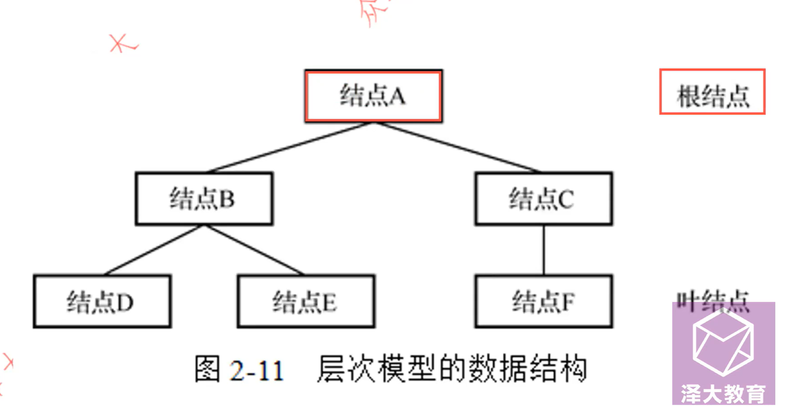
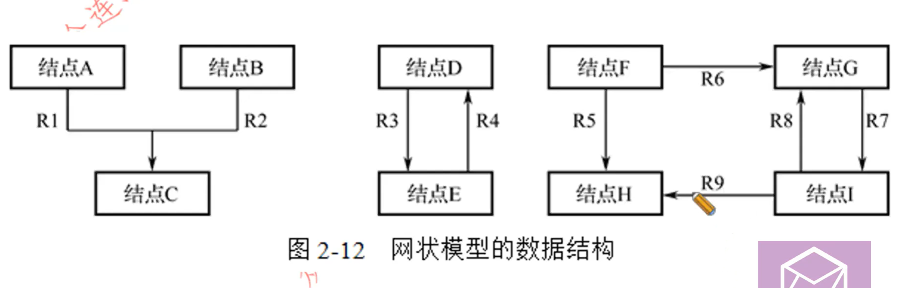
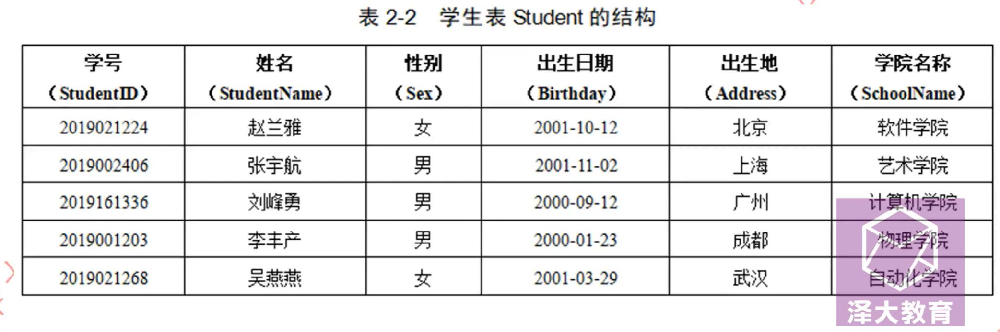

# 数据模型（ Data Model ）

- 数据模型是严格定义的一组**概念的集合** （这行不考）
- **数据模型是数据库系统的核心和基础**  （必背）
- 描述数据的**结构**及**操作**和**约束条件**

## 数据模型的三要素

数据模型通常由**数据结构、数据操作和数据完整性拘束条件**三部分组成。

## 数据结构

数据操作是对系统**静态特性**的描述

## 数据操作

数据库主要有 `查询和更新` 两大类操作

### 更新

- 插入
- 修改
- 删除

数据操作是对系统**动态特性**的描述

## 数据完整性约束

数据的约束条件是一组 `完整性规则` 的集合

### 完整性规则

- 保障了数据**正确、有效、相容**

## 数据模型的分类

### 按应用层次分

- 概念模型
- 逻辑和物理模型

### 按数据结构分
- 层次模型
- 网状模型
- 关系模型

以上三个必背，以下最好记忆

- 面向对象模型
- 对象关系模型

层次和网状模型统称为**非关系模型**，也称为**格式化模型**

## 层次模型

- 以**树**的形式
- 有且仅有一个节点，并且没有双亲，称为根节点
- 有且仅有一个其它

### 优点

- 结构简单清晰
- 效率很高
- 良好的完整性支持

### 缺点
- 不能多对多
- 查询不灵活
- 编写较为复杂

## 网状模型

- 以**网/图**的形式
- 有一个以上的节点没有父节点
- 节点可以有多于一个的父节点

### 优缺点

- 查询效率高，能表达复杂联系
- 结构复杂，操作复杂，编写复杂

## 关系模型

- 规范化的 `二维表`，也称为 `表` （表中不能有表，行列/分量不可再分）
- **关系就是二维表**
- 一行为一个 `元组`
- 一列为一个 `属性`
- 唯一标识一行/一个元组的属性集合，为 `码`，最小属性集合为 `候选码` ，`候选码` 任意挑一个为 `主码`
- 属性的取值范围称为 `域` , 不同列可以来自相同的域 ，同一列不可以来自不同的域
- 行和列的交叉为 `分量`
- 关系的型称为 `关系模式` ，关系模式是对关系的描述。`关系名(属性1，属性2，属性...)`
- 实体和实体之间的联系用 `关系` 来表示

### 关系模型的数据操作和完整性约束条件

实体完整性、参照完整性、用户定义的完整性

### 关系模型与非关系模型的区别

- 关系模型建立在严格的数学概念基础上
- 概念单一、结构清晰、容易理解

### 关系模型的优缺点

- 数据独立性高，结构简单
- 查询效率不如其它模型，需要做查询优化