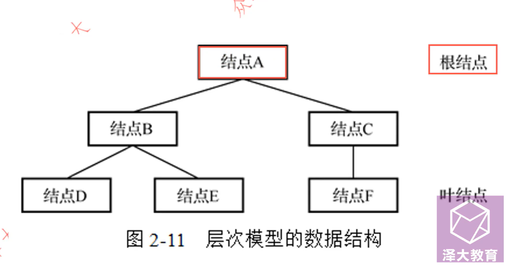
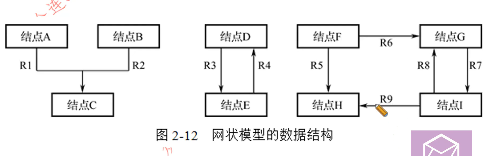

# 数据模型（ Data Model ）

- 数据模型是严格定义的一组**概念的集合** （这行不考）
- **数据模型是数据库系统的核心和基础**  （必背）
- 描述数据的**结构**及**操作**和**约束条件**

## 数据模型的三要素

数据模型通常由**数据结构、数据操作和数据完整性拘束条件**三部分组成。

## 数据结构

数据操作是对系统**静态特性**的描述

## 数据操作

数据库主要有 `查询和更新` 两大类操作

更新

- 插入
- 修改
- 删除

数据操作是对系统**动态特性**的描述

## 数据完整性约束

数据的约束条件是一组 `完整性规则` 的集合

### 完整性规则

- 保障了数据**正确、有效、相容**

## 数据模型的分类

### 按应用层次分

- 概念模型
- 逻辑和物理模型

### 按数据结构分
- 层次模型
- 网状模型
- 关系模型

以上三个必背，以下最好记忆

- 面向对象模型
- 对象关系模型

层次和网状模型统称为**非关系模型**，也称为**格式化模型**

## 层次模型

- 以**树**的形式
- 有且仅有一个节点，并且没有双亲，称为根节点
- 有且仅有一个其它

## 网状模型

- 以**网/图**的形式
- 有一个以上的节点没有父节点
- 节点可以有多于一个的父节点

## 关系模型

- 规范化的 `二维表`
