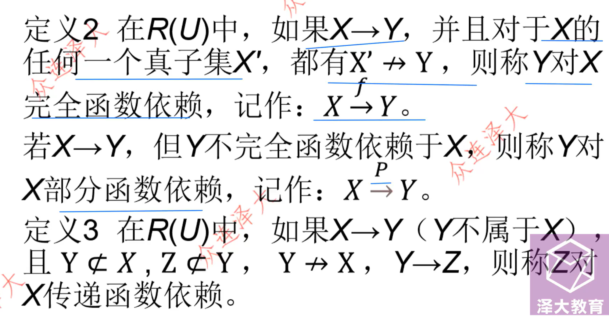

# 规范化

## 范式的种类

1NF 包含 2NF 包含 3NF 包含 BCNF 包含 `4NF（不考）`

## 第一范式

- 分量不可再分
- 属性不可再分
- 表中不能有表
- 列取原子值

## 第二范式

- 消除了非主属性对候选键的部分函数依赖

## 第三范式

- 消除了非主属性对候选键的全部函数依赖

## BCNF

- 消除冗余

## 函数依赖

- 平凡函数依赖
- 非平凡函数依赖
    - 部分函数依赖/完全函数依赖
    - 传递函数依赖

## 术语

